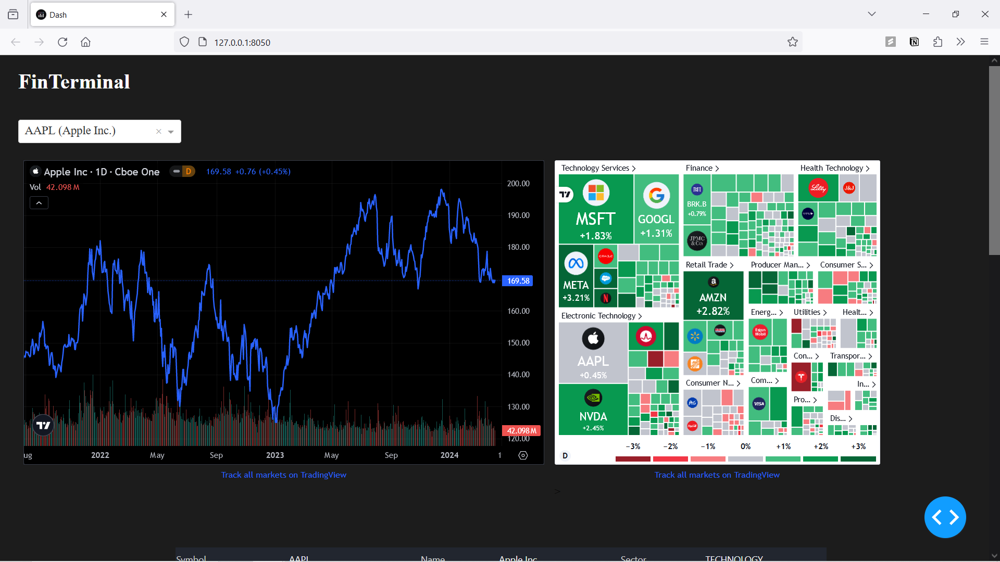
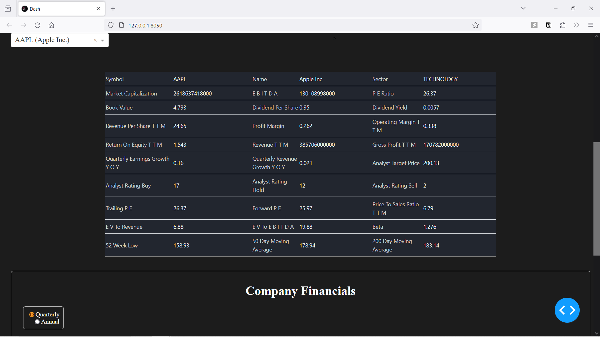
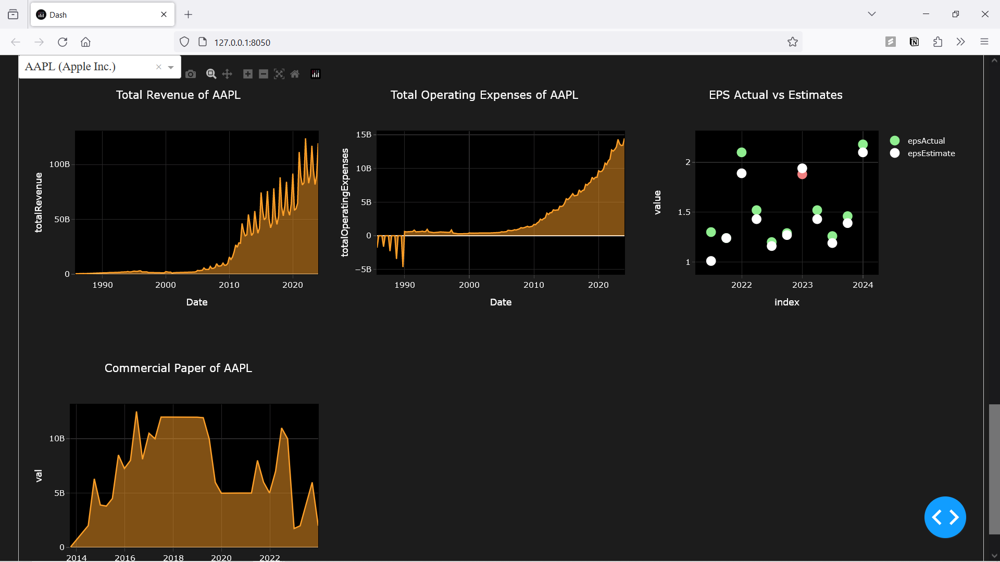

<!DOCTYPE html>
<html lang="en">
<head>
    <meta charset="UTF-8">
    <meta name="viewport" content="width=device-width, initial-scale=1.0">
<!--     <title>FinTerminal Documentation</title> -->
</head>
<body>

<h1>FinTerminal - Flask Application for Financial Analysis</h1>

FinTerminal is a Flask-based web application designed for financial analysis. It provides interactive visualization of company financials using various data sources and APIs.

<h2>Installation</h2>

<li>Clone the Repository:</li>
<pre><code>git clone https://github.com/yourusername/finterminal.git</code></pre>

<li>Set Up Virtual Environment (Optional but Recommended):</li>
<pre><code>python3 -m venv venv source venv/bin/activate  # For Linux/Mac .\venv\Scripts\activate    # For Windows</code></pre>

<li>Install Required Packages:</li>
<pre><code>pip install -r requirements.txt</code></pre>

<h2>Usage</h2>

Run the Flask application:

<pre><code>python app.py</code></pre>

Open a web browser and navigate to <code>http://127.0.0.1:8050</code> (or another local address displayed in the terminal) to access the application.

<h2>Screenshots</h2>

Include screenshots of your application to showcase its functionality:

Screenshot 1: Dashboard

Screenshot 2: Quick Glance

Screenshot 3: Charts

<h2>Features</h2>

<ul>
    <li><strong>Interactive Financial Charts:</strong> Visualize revenue, expenses, gross profit, net income, and more with interactive charts.</li>
    <li><strong>Company Comparison:</strong> Compare financial metrics across different companies using dropdown selection.</li>
    <li><strong>Real-time Market Data:</strong> Access real-time market data and stock information using TradingView widgets.</li>
    <li><strong>SEC Filings Integration:</strong> Retrieve additional parameters and financial details from SEC filings.</li>
</ul>

<h2>API Documentation Links</h2>

<ul>
    <li><strong>TradingView API:</strong> <a href="https://www.tradingview.com/rest-api-spec/">TradingView Charting Library API Reference</a></li>
    <li><strong>SEC EDGAR API:</strong> <a href="https://www.sec.gov/edgar/sec-api-documentation">SEC EDGAR API Documentation</a></li>
    <li><strong>Darqube API:</strong> <a href="https://www.darqube.io/docs/">Darqube API Documentation</a></li>
    <li><strong>Alpha Vantage API:</strong> <a href="https://www.alphavantage.co/documentation/">Alpha Vantage API Documentation</a></li>
</ul>

</body>
</html>
